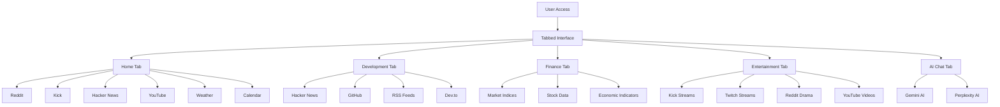

<div align="center">

# 🚀 Dashboard

[](https://svelte.dev/)
[](https://kit.svelte.dev/)
[](https://www.typescriptlang.org/)
[](https://tailwindcss.com/)
[](https://opensource.org/licenses/MIT)

**A modern, tabbed dashboard application built with SvelteKit and TypeScript, featuring various widgets for news, weather, development tools, finance, and entertainment**

*Your all-in-one hub for staying updated with the latest in tech, finance, entertainment, and AI*

[Installation](#-installation) •
[Features](#-features) •
[Development](#-development) •
[Deployment](#-deployment) •
[Contributing](#-contributing) •
[License](#-license)

</div>

---

## 📖 Overview

Dashboard is a comprehensive web application that aggregates information from multiple sources into an organized, tabbed interface. Built with modern web technologies, it provides real-time updates on news, weather, development trends, financial data, entertainment content, and AI-powered chat capabilities.



<div align="center">
  <p><i>Dashboard architecture showing tab organization and data sources</i></p>
</div>

## Features

- **5-Tab Interface**: Organized into Home, Development, Finance, Entertainment, and AI Chat tabs
- **Responsive Design**: Works seamlessly on desktop and mobile devices
- **Dark/Light Themes**: Automatic theme switching support
- **Built-in Caching**: TTL-based caching system for optimal performance
- **AI Chat**: Interactive chat with Gemini and Perplexity AI, including copy-to-clipboard functionality

### Tab Organization

**🏠 Home**
- Reddit posts and discussions
- Kick streaming content
- Hacker News stories
- YouTube videos
- Weather information
- Calendar events

**💻 Development**
- Hacker News tech stories
- GitHub trending repositories
- RSS feeds for tech news
- Dev.to articles

**💰 Finance**
- Market indices and performance
- Stock market data
- Economic indicators

**🎮 Entertainment**
- Kick gaming streams
- Twitch live streams
- Reddit drama discussions
- YouTube entertainment videos

**🤖 AI Chat**
- Interactive AI conversations
- Support for Gemini and Perplexity models
- Conversation history viewer
- Copy-to-clipboard for assistant responses

## Installation

1. Clone the repository:
   ```bash
   git clone https://github.com/CodingInCarhartts/dashboard
   cd dashboard
   ```

2. Install dependencies:
   ```bash
   npm install
   ```

3. Set up environment variables:
    ```bash
    cp src/lib/env.example.ts src/lib/env.ts
    ```
    Edit `src/lib/env.ts` and add your API keys:

    **Required API Keys:**
    - `PERPLEXITY_API_KEY`: Perplexity API key for AI chat
    - `GEMINI_API_KEY`: Google Gemini API key for AI chat
    - `SUPABASE_URL`: Your Supabase project URL
    - `SUPABASE_API_KEY`: Your Supabase anon/public API key
    - `SUPABASE_DATABASE_PASSWORD`: Your Supabase database password

    **Optional API Keys (for enhanced features):**
    - `KICK_SECRET`: Kick API secret for streaming data
    - `TWITCH_CLIENT_ID`: Twitch API client ID
    - `TWITCH_CLIENT_SECRET`: Twitch API client secret
    - `ECONOMIC_API_KEY`: API key for economic indicators
    - `FINNHUB_API_KEY`: Finnhub API key for financial data
    - `YOUTUBE_API_KEY`: YouTube Data API key
    - `REDDIT_ID`: Reddit API client ID
    - `REDDIT_SECRET`: Reddit API client secret

4. Set up Supabase database:
    - Create a new project at [supabase.com](https://supabase.com)
    - Go to Settings > API to get your project URL and API keys
    - The database schema will be automatically created when you first run the application
    - Chat conversations and other persistent data will be stored in Supabase

5. Start the development server:
   ```bash
   npm run dev
   ```

## Development

### Available Scripts

- `npm run dev` - Start development server with hot reload (accessible at 0.0.0.0)
- `npm run build` - Build for production
- `npm run preview` - Preview production build locally
- `npm run check` - Run TypeScript type checking with svelte-check
- `npm run check:watch` - Run type checking in watch mode
- `npm run prepare` - Sync SvelteKit (runs automatically with npm install)

### Tech Stack

- **Framework**: SvelteKit + Svelte 5
- **Language**: TypeScript (strict mode)
- **Styling**: Tailwind CSS with custom utilities
- **UI Components**: bits-ui + shadcn-svelte
- **Adapter**: Deno adapter for deployment
- **State Management**: Svelte stores
- **Caching**: Custom TTL-based cache system

### Code Style

- 2 spaces indentation, single quotes, no semicolons
- `$lib/` import alias
- Explicit types first in imports
- `$$Props` for component props
- `@apply` directives in styles
- `cn()` utility for Tailwind classes
- No comments in code
- PascalCase for components, camelCase for variables/functions
- kebab-case for files

## Deployment

The application uses the **Deno adapter** for deployment, making it compatible with Deno-based hosting platforms.

### Build Process

1. Build the application:
   ```bash
   npm run build
   ```

2. The build output will be in the `.svelte-kit` directory, optimized for Deno deployment.

### Deployment Options

- **Deno Deploy**: Push directly to Deno Deploy for serverless deployment
- **Vercel/Netlify**: Use their Deno runtime support
- **Self-hosted**: Deploy the built application to any server supporting Deno

### Environment Variables

Ensure all environment variables are properly configured in your deployment platform's environment settings. The required Supabase variables are essential for data persistence.

## Contributing

1. Follow the established code style
2. Run type checking before committing: `npm run check`
3. Test your changes thoroughly

## License

MIT License

Copyright (c) 2025 CodingInCarhartts

Permission is hereby granted, free of charge, to any person obtaining a copy
of this software and associated documentation files (the "Software"), to deal
in the Software without restriction, including without limitation the rights
to use, copy, modify, merge, publish, distribute, sublicense, and/or sell
copies of the Software, and to permit persons to whom the Software is
furnished to do so, subject to the following conditions:

The above copyright notice and this permission notice shall be included in all
copies or substantial portions of the Software.

THE SOFTWARE IS PROVIDED "AS IS", WITHOUT WARRANTY OF ANY KIND, EXPRESS OR
IMPLIED, INCLUDING BUT NOT LIMITED TO THE WARRANTIES OF MERCHANTABILITY,
FITNESS FOR A PARTICULAR PURPOSE AND NONINFRINGEMENT. IN NO EVENT SHALL THE
AUTHORS OR COPYRIGHT HOLDERS BE LIABLE FOR ANY CLAIM, DAMAGES OR OTHER
LIABILITY, WHETHER IN AN ACTION OF CONTRACT, TORT OR OTHERWISE, ARISING FROM,
OUT OF OR IN CONNECTION WITH THE SOFTWARE OR THE USE OR OTHER DEALINGS IN THE
SOFTWARE.